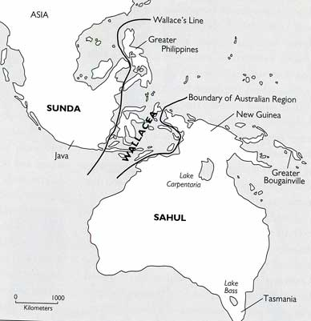

# Cassowary Evolution and Expansion: Geographic Context

This document provides geographic context for understanding cassowary evolution and the expansion of their civilization across Sahul (Greater Australia).

---

## Evolutionary Geography

### The Cassowary-Emu Divergence (~25 Million BCE)

The divergence of cassowaries and emus occurred during the Late Oligocene when Australia was significantly wetter and more forested than today. Key geographic features during this period included:

1. **Northern Rainforests**

   - Dense tropical and subtropical rainforests covered much of northern Australia
   - Proto-cassowaries specialized in these densely vegetated environments
   - Modern Daintree Rainforest represents a remnant of this once-vast ecosystem

2. **Central Woodlands**

   - Open woodlands began to develop in central regions
   - Proto-emus adapted to these more open habitats
   - Evolutionary pressures favored different adaptations in these distinct environments

3. **Land Bridges**
   - Australia and New Guinea formed a single landmass (Sahul)
   - Continuous forested corridors allowed movement between regions
   - Population interchange occurred freely across what is now the Torres Strait

_The ancient continent of Sahul showing the connected landmasses of Australia, New Guinea, and Tasmania during periods of lower sea levels._

---

## Early Adaptation Regions (12-2 Million BCE)

### Rainforest Adaptation Zones

1. **Cape York Peninsula**

   - Primary region for forelimb evolution and adaptation
   - Dense rainforest canopy created selective pressure for climbing adaptations
   - Relatively stable environment allowing specialized adaptations to develop

2. **New Guinea Highlands**
   - Secondary center of cassowary diversification
   - Higher altitude forests required specialized adaptations
   - Isolation of populations in valleys led to subtle variations in forelimb development

### Transitional Zones

1. **Arnhem Land**

   - Mixed forest and woodland environment
   - Interface between cassowary and emu adaptations
   - Evidence of _Emuarius_ populations persisting longer in this region

2. **Coastal Queensland**
   - Mixture of rainforest and more open habitat
   - Seasonal variations drove behavioral flexibility
   - Key region for early tool use development

---

## Fire Revolution Geography (~1 Million BCE)

The discovery and mastery of fire occurred in specific geographic contexts that shaped its development:

1. **Lightning Strike Zones**

   - Northern savanna regions with frequent lightning strikes
   - Seasonal dry periods creating natural fire conditions
   - Border regions between forests and developing grasslands

2. **Early Hearth-Centered Settlements**

   - **Kakadu Region:** Evidence of earliest fire management
   - **Cape York Highland Areas:** Protected fire sites in cave environments
   - **Lake Carpentaria Region:** Seasonal settlements with hearth remains

3. **Fire-Enabled Expansion**
   - Fire management allowed expansion into previously marginal habitats
   - Seasonal burning created managed landscapes in central Australia
   - Coastal corridors maintained through fire management

---

## Early Civilization Centers (500,000 - 50,000 BCE)

### Primary Settlement Regions

1. **Northern Wetlands**

   - **Kakadu Analogues:** Centers of early social complexity
   - Combination of aquatic resources and managed fire landscapes
   - Evidence of early insect domestication and management

2. **Riverine Corridors**

   - **Murray-Darling System:** Major north-south movement corridor
   - Supported larger population densities through diverse resource availability
   - Enabled cultural exchange between regional populations

3. **Coastal Networks**
   - **Eastern Seaboard:** Chain of connected settlements
   - Marine resources supplemented terrestrial domestication
   - Enabled trade and communication along coastal routes

---

## Civilization Expansion (50,000 BCE - Present)

### Urban Centers

1. **Werribee Region**

   - Prime agricultural land with volcanic soils
   - Confluence of major waterways enabling transportation
   - Eventually developed into the capital of cassowary civilization

2. **Northern Cities**

   - Based around managed rainforest environments
   - Specialized in biological resource management
   - Maintained traditional connections to cassowary evolutionary homeland

3. **Interior Trading Hubs**
   - Developed at intersections of major travel routes
   - Specialized in resource processing and distribution
   - Often centered around mining operations or specialized agriculture

### Empire Building

1. **Continental Integration**

   - Road networks connecting major regions
   - Standardized communication systems using domesticated birds
   - Administrative centers controlling regional resources

2. **Geographic Specialization**

   - Highland mining regions
   - Coastal trading ports
   - Agricultural heartlands
   - Industrial processing centers

3. **Resource Management Systems**
   - Watershed control infrastructure
   - Managed forest systems
   - Agricultural intensification zones

---

## Geographic Determinants of Culture

The unique geography of Sahul shaped cassowary civilization in several distinctive ways:

1. **Isolation and Innovation**

   - Geographic isolation from other continents fostered independent development
   - Diverse environments within Sahul drove specialized adaptations
   - Limited resources in some regions encouraged innovative solutions

2. **Connectivity Challenges**

   - Vast distances between resource-rich regions
   - Seasonal variations in water availability affecting movement
   - Mountain ranges and deserts creating natural barriers

3. **Environmental Management**
   - Fire-adapted landscapes requiring regular management
   - Seasonal flooding cycles dictating agricultural patterns
   - Limited mineral resources driving technological innovation

---

## Current Geographic Centers (Modern Era)

1. **Werribee** - Capital and largest urban center

   - Located in what humans would call Victoria
   - Major transportation hub connecting continental networks
   - Center of corporate governance and administration

2. **Northern Resource Territories**

   - Rainforest management zones
   - Biological resource extraction
   - Traditional cultural heartlands

3. **Central Processing Regions**

   - Mining and industrial centers
   - Transportation corridor control points
   - Major diprotodon breeding facilities

4. **Coastal Corporation States**
   - Trading ports controlling maritime resources
   - Specialized manufacturing centers
   - International contact points (limited)

---

## Comparing Human and Cassowary Geographic Development

The geographic development of cassowary civilization differs from human patterns in several key ways:

1. **Bioregional Integration vs. Conquest**

   - Cassowary expansion focused on integrating with and enhancing existing ecosystems
   - Human expansion often involved replacement of ecosystems with agricultural systems

2. **Multi-Species Urbanism**

   - Cassowary cities incorporate multiple domesticated species as integral components
   - Human cities typically segregate domesticated species into specialized spaces

3. **Fire-Centered Land Management**
   - Cassowary civilization maintained continent-wide fire management systems
   - Human approaches varied widely across different regions and cultures

The resulting landscape reflects these different approaches, with cassowary civilization creating a managed mosaic of habitats optimized for multiple species rather than the human pattern of simplified agricultural landscapes.
